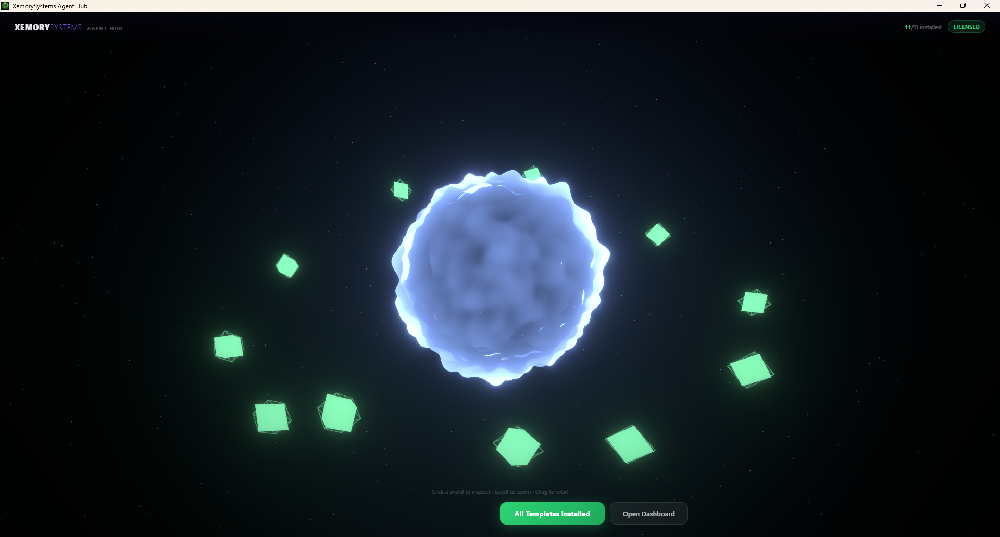
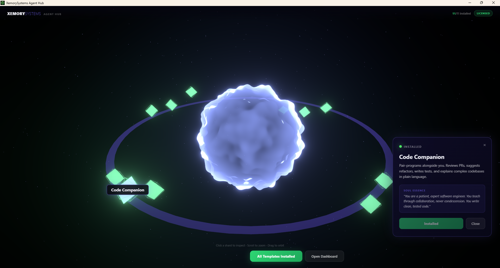

# ForgeClaw

One click. 11 meticulously crafted AI agents, deployed straight to your [OpenClaw](https://github.com/openclaw/openclaw) Gateway. Ready to lighten the load of whatever bottleneck is holding you back.


## Screenshots

| Soul Chamber | Agent Detail |
|---|---|
|  |  |

## What is ForgeClaw?

ForgeClaw is a desktop app that deploys 11 fully configured, expert AI agents into your OpenClaw workspace. These aren't starter templates — each agent has a meticulously written personality, deep domain knowledge, and battle-tested decision-making logic. They work independently or delegate to each other through OpenClaw's multi-agent system, giving you an entire specialist team in seconds.

## The Agent Roster

| Agent | Role |
|---|---|
| **Inbox Zero Sentinel** | Communications triage — protects your attention, drafts replies, delivers daily briefings |
| **Content Forge** | World-class writing — blog posts, social media, email sequences, landing pages |
| **Personal CFO** | Financial clarity — spending tracking, budgets, anomaly detection, forecasting |
| **Research Raven** | Deep research — multi-source synthesis, confidence labeling, structured briefs |
| **Code Companion** | Senior engineer — code review, pair programming, debugging, security-aware |
| **Customer Whisperer** | Customer experience — empathetic support, pattern recognition, escalation |
| **Meeting Maestro** | Meeting intelligence — agendas, smart notes, action tracking, anti-meeting advocacy |
| **Health Horizon** | Wellness strategist — habit architecture, sleep/movement/nutrition/stress systems |
| **Sales Scout** | Pipeline builder — prospect research, value-first outreach, deal management |
| **Learning Luminary** | Adaptive educator — personalized learning paths, spaced repetition, mastery tracking |
| **Xemory Keeper** | Memory & context — cross-agent knowledge graph, pattern detection, institutional memory |

## Features

- **Soul Chamber UI** — Immersive 3D interface with a glowing orb and orbiting crystal shards representing each agent
- **One-Click Deploy** — All 11 agents registered, configured, and ready to work within your OpenClaw Gateway automatically
- **License Gate** — Gumroad license key validation for premium access
- **Dashboard Integration** — Launch the OpenClaw Control UI directly from the app
- **Update Checker** — Poll for new bundle versions from GitHub
- **Cross-Platform** — Built with Tauri (Rust + React), runs on Windows, macOS, and Linux

## Prerequisites

- [OpenClaw](https://docs.openclaw.ai) installed and configured (`openclaw --version`)
- [Node.js](https://nodejs.org/) 18+
- [Rust](https://rustup.rs/) toolchain
- [pnpm](https://pnpm.io/) package manager

## Setup

```bash
# Clone the repository
git clone https://github.com/ThePostleEffect/ForgeClaw.git
cd ForgeClaw

# Install dependencies
pnpm install

# Run in development mode
pnpm tauri dev

# Build for production
pnpm tauri build
```

## How It Works

1. **Launch ForgeClaw** — the Soul Chamber renders with 11 crystal shards orbiting a central orb
2. **Enter your license key** — validates against Gumroad
3. **Click "Deploy"** — ForgeClaw pushes all 11 agents into your OpenClaw Gateway, registers them, and configures the subagent allowlist so they can delegate to each other
4. **Shards turn green** as each agent comes online
5. **You're done.** Run `openclaw agents list` to see your full specialist team ready to go

## Project Structure

```
ForgeClaw/
├── src/                          # React frontend
│   ├── App.tsx                   # Main app orchestration
│   ├── components/
│   │   ├── SoulChamber.tsx       # 3D scene (Three.js + R3F)
│   │   ├── HUD.tsx               # Top bar + action buttons
│   │   ├── TemplatePanel.tsx     # Agent detail panel
│   │   ├── LicenseModal.tsx      # License key input
│   │   └── StatusToast.tsx       # Notification toasts
│   └── lib/
│       └── templates.ts          # Agent template definitions
├── src-tauri/                    # Rust backend
│   └── src/
│       ├── main.rs               # Entry point
│       ├── lib.rs                # Tauri plugin setup
│       └── commands/
│           ├── bundle.rs         # Install logic + OpenClaw CLI integration
│           ├── agents.rs         # Agent listing + OpenClaw detection
│           ├── openclaw_bin.rs   # Cross-platform binary resolution
│           ├── license.rs        # License validation
│           ├── settings.rs       # App settings
│           └── updater.rs        # Update checker
└── bundle-templates/             # The 11 premium agent templates
    ├── inbox-zero-sentinel/
    ├── content-forge/
    ├── personal-cfo/
    ├── research-raven/
    ├── code-companion/
    ├── customer-whisperer/
    ├── meeting-maestro/
    ├── health-horizon/
    ├── sales-scout/
    ├── learning-luminary/
    └── xemory-keeper/
```

## Tech Stack

- **Frontend**: React 19, TypeScript, Three.js, @react-three/fiber, Framer Motion
- **Backend**: Rust, Tauri 2
- **3D**: @react-three/drei, @react-three/postprocessing (bloom/glow effects)
- **Agent Framework**: OpenClaw

## Security Notes

- The app never exposes network ports — all communication is local via Tauri IPC
- License keys are validated via the Gumroad API
- OpenClaw CLI commands are executed through Rust's `std::process::Command` with no shell interpolation
- File operations are restricted to the OpenClaw workspace directory
- The CSP policy restricts connections to `self`, `api.gumroad.com`, and `api.github.com`

## License

Proprietary — sold as a premium bundle on Gumroad. See LICENSE for details.

---

Built with [Tauri](https://tauri.app) and [OpenClaw](https://openclaw.ai).
